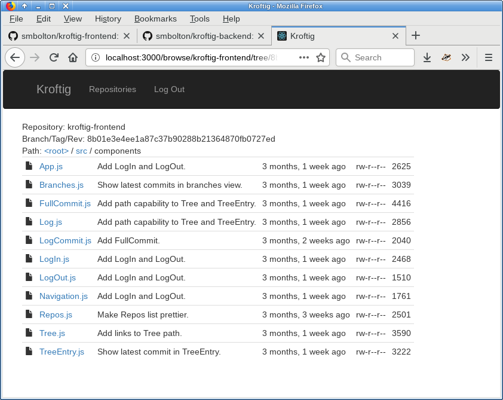

+++++++++++++++++
Kroftig - Backend
+++++++++++++++++

|license|

.. |license| image:: https://img.shields.io/badge/License-MIT-yellow.svg
   :target: https://en.wikipedia.org/wiki/MIT_License
   :alt: MIT Licensed

.. .. |build| image:: https://travis-ci.org/smbolton/kroftig.svg?branch=master
   :target: https://travis-ci.org/smbolton/kroftig
   :alt: Build Status

*Kroftig* ('git fork' backwards) is a web-based tool for auditing multiple related git repositories.
This repository holds the back end, which is written using Django, Graphene-Django, Graphene,
GraphQL, pygit2, and libgit2. The front end is `here <https://github.com/smbolton/kroftig-frontend>`_.

**Development of Kroftig is suspended**, for two reasons:

* The original project for which I planned to use Kroftig ceased to have value, and

* Graphene_, the Python GraphQL_ framework upon which this backend is built, is not mature
  enough for anything but very straightforward use. When I return to this project, if
  Graphene hasn't matured, I will re-write the backend using Node.js and express-graphql_.

.. _Graphene: https://github.com/graphql-python/graphene
.. _GraphQL: http://graphql.org/
.. _express-graphql: https://github.com/graphql/express-graphql

At its present stage of development, Kroftig presents a React-based single-page
application in the browser, with which one may browse git repositories on the backend
server in much the same way as GitHub. As such, it may be an valuable base for custom
web-based git tools.

Installation
============

.. code:: shell

   $ git clone https://github.com/smbolton/kroftig-backend.git
   $ cd kroftig-backend
   $ virtualenv --python=python3 venv
   $ source venv/bin/activate
   $ pip install -r requirements.txt
   $ ./manage.py makemigrations
   $ ./manage.py migrate
   $ ./manage.py test  # all tests should pass
   $ ./manage.py runserver

The server includes the GraphiQL_ schema-browser IDE, so once you have the server running, point
your browser at:

http://localhost:8000/graphql/

and you will be able to browse the schema and submit test queries.

.. _GraphiQL: https://github.com/graphql/graphiql

License
=======
Copyright © 2017 Sean Bolton.

Permission is hereby granted, free of charge, to any person obtaining
a copy of this software and associated documentation files (the
"Software"), to deal in the Software without restriction, including
without limitation the rights to use, copy, modify, merge, publish,
distribute, sublicense, and/or sell copies of the Software, and to
permit persons to whom the Software is furnished to do so, subject to
the following conditions:

The above copyright notice and this permission notice shall be
included in all copies or substantial portions of the Software.

THE SOFTWARE IS PROVIDED "AS IS", WITHOUT WARRANTY OF ANY KIND,
EXPRESS OR IMPLIED, INCLUDING BUT NOT LIMITED TO THE WARRANTIES OF
MERCHANTABILITY, FITNESS FOR A PARTICULAR PURPOSE AND
NONINFRINGEMENT. IN NO EVENT SHALL THE AUTHORS OR COPYRIGHT HOLDERS BE
LIABLE FOR ANY CLAIM, DAMAGES OR OTHER LIABILITY, WHETHER IN AN ACTION
OF CONTRACT, TORT OR OTHERWISE, ARISING FROM, OUT OF OR IN CONNECTION
WITH THE SOFTWARE OR THE USE OR OTHER DEALINGS IN THE SOFTWARE.
